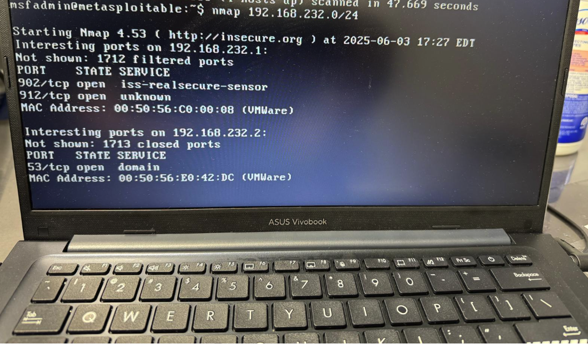
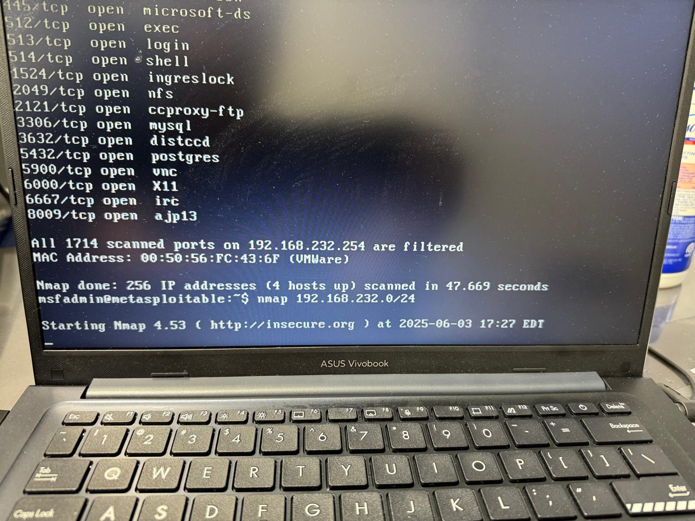
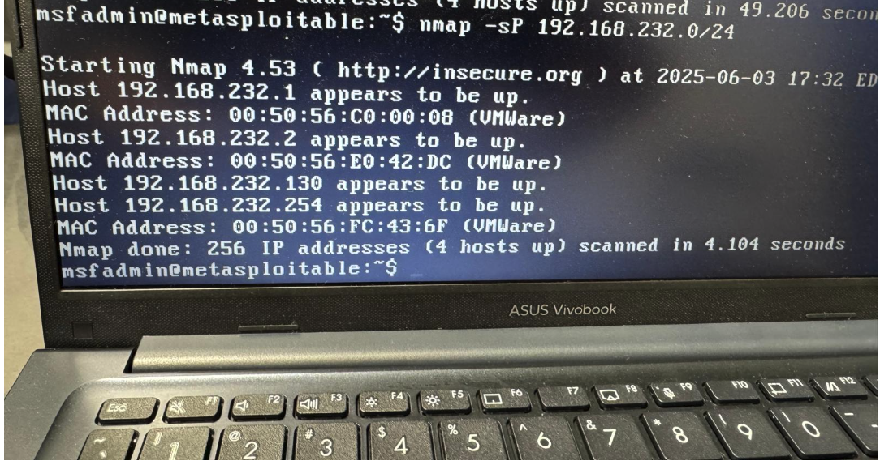
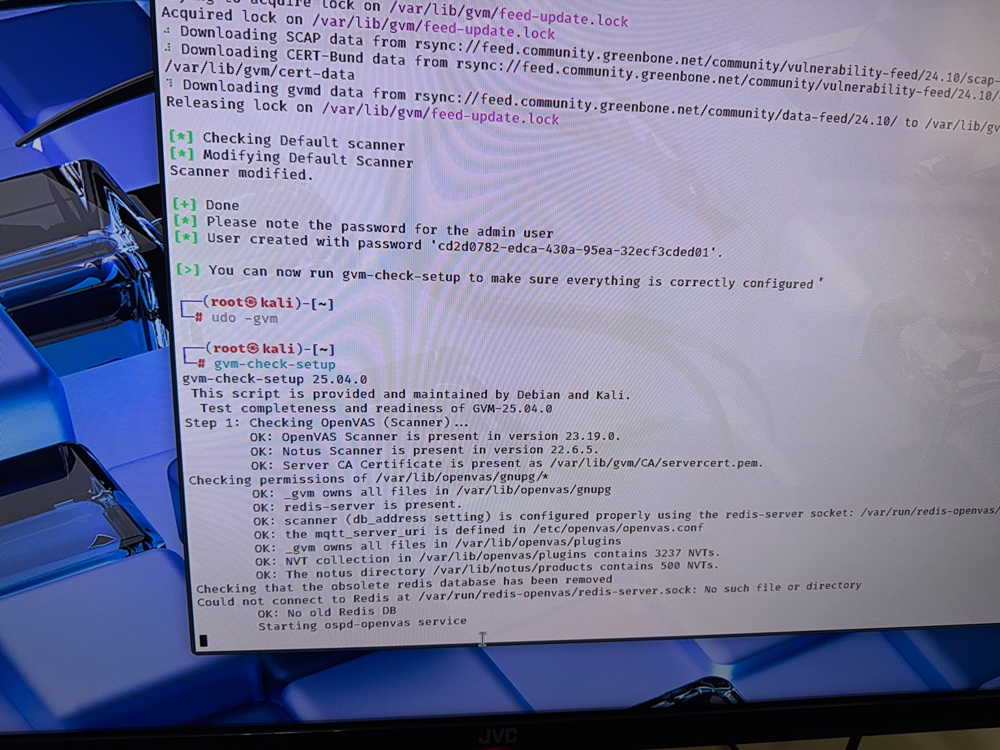
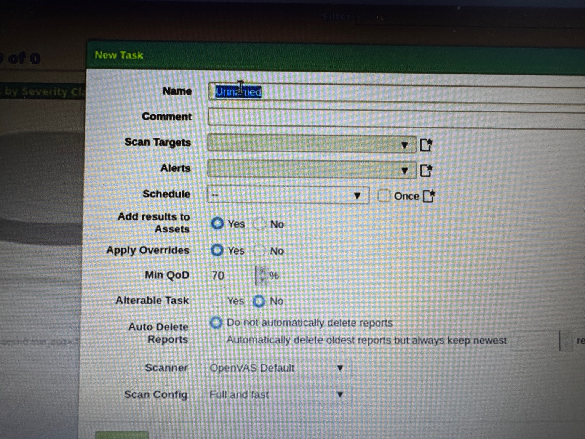
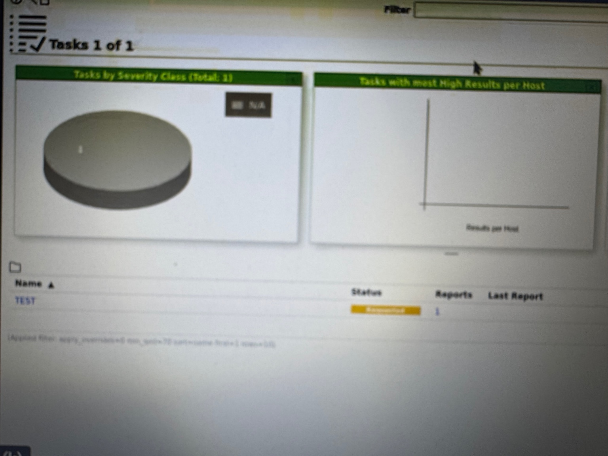

# CS-Intern
A professional-grade cybersecurity lab environment with VM setups, network configurations, and tools for hands-on training in threat detection, penetration testing, and incident response.

# Lab Environment Preparation
 Set up and validate the host system to ensure it meets the minimum technical requirements for running virtualized lab environments. The following prerequisites must be fulfilled:
 
*)VirtualBox (Primary virtualization platform)
*) VMware Workstation Player (Optional, as an alternative or secondary platform)

*)Task Start date: 05-21-2025

*)Task End Date: 06-02-2025

# 1. Executive Summary
This report outlines the design and implementation of a comprehensive cybersecurity lab environment to simulate real-world offensive and defensive security operations. Utilizing a multi-virtual machine (VM) architecture, the lab enables hands-on experience in vulnerability assessment, penetration testing, threat detection, and incident response.

The lab incorporates the following components:

*) Kali Linux as the attacker machine

*) Metasploitable2 as the vulnerable target

*) Security Onion as the monitoring and alerting system

*) pfSense as the firewall and gateway

*) Ubuntu Server as an optional internal host

 Primary Objectives:

Build a controlled cybersecurity training lab

Develop practical skills in offensive and defensive security

Conduct vulnerability assessments and penetration testing

Deploy and analyze SIEM tools for monitoring and alerting

# 2. Lab Architecture & Network Topology

#2.1 Virtualization Platform
Hypervisor: Oracle VirtualBox (cross-platform compatibility)

Networking Configuration:

Adapter 1: NAT (Internet access)

Adapter 2: Host-Only (internal isolated network)

#2.2 Virtual Machines Configuration

VM Name       Purpose        Network Configuration        Key Tools
------------------------------------------------------------------- 
     

   -----------------------------------------------------------------
#Network Diagram

   #  Step-by-Step Implementation
   # 3.1 pfSense Firewall Configuration 
     
  Installation
1. Downloaded the latest pfSense Community Edition ISO from the official website.
2. Created a new VM in VirtualBox with:
 *)GB RAM, 2 CPUs, 20 GB storage.
 *)Two network adapters:
     i)Adapter 1: NAT (for internet access).
     ii)Adapter 2: Host-Only (for internal LAN).
3. Booted the VM, followed the pfSense installer prompts, and completed the setup.   

# LAN Configuration

1. Set the LAN interface IP to 192.168.56.1/24 via the pfSense web interface (accessible at https://192.168.56.1).

2. Enabled the DHCP server to assign IPs in the range 192.168.56.100-200.

3. Configured firewall rules:

i)Allowed ICMP (ping) for network diagnostics.
ii)Permitted HTTP/HTTPS for Security Onion’s Kibana dashboard.
iii)Restricted SSH access to specific IPs (e.g., blocked Kali Linux from accessing Ubuntu Server).

#Validation
i)Verified connectivity by pinging the LAN IP from other VMs.
ii)Confirmed DHCP assignments and firewall rule enforcement via the pfSense dashboard.

# 3.2  Kali Linux (Attacker VM) Setup

# Installation

1. Downloaded the latest Kali Linux ISO (64-bit) from kali.org.
2. Created a VirtualBox VM with:
       i)4 GB RAM, 2 CPUs, 40 GB storage.
       ii)Network: Host-Only adapter (DHCP from pfSense).
3. Installed Kali Linux using the default graphical installer.

# Configuration
1. Verified the assigned IP address using ifconfig (e.g., 192.168.56.100).
2. Updated the system and tools:

sudo apt update && sudo apt full-upgrade -y

3. Installed additional tools (if not pre-installed):
sudo apt install openvas metasploit-framework wireshark -y

# ScreenShot

# WireShark Updates
### TCP SYN Scans Explained

**TCP SYN Scan Overview:**

- **Avoids Full Three-Way Handshake:** Unlike a typical TCP connection that requires a complete three-way handshake (SYN, SYN-ACK, ACK), a SYN scan only initiates the process by sending a SYN packet. It does not complete the handshake, allowing for a quick and stealthy scan without establishing a full connection.

- **Commonly Executed with nmap -sS:** This type of scan is frequently performed using the `nmap -sS` command, a popular network scanning tool. The `-sS` option instructs nmap to perform a SYN scan, making it efficient for mapping network ports and identifying open services.

- **Requires Privileged Access:** SYN scans typically require elevated user privileges (e.g., root or administrator access) on the scanning system, as they involve crafting raw packets that standard users cannot generate.

- **Packet Size Characteristics:** The packets in a SYN scan are generally small, typically 1024 bytes or less. This is because the scan only sends an initial SYN request without expecting a full data exchange, as the connection is not intended to be completed.

### Detailed Analysis of the Attached Screenshot

The attached image shows a packet capture from Wireshark, a network protocol analyzer, displaying a TCP SYN scan in progress. Here's a breakdown of the key elements:

- **Filter Applied:** The capture is filtered to show packets where `tcp.flags.syn==1` (SYN flag set), `tcp.flags.ack==0` (ACK flag not set), and `tcp.window_size > 1024`. This filter isolates SYN packets that are part of a scan, indicating the start of a connection attempt without an acknowledgment.

- **Packet Details:**
  - **No. and Time:** The capture lists multiple packets (e.g., 0, 2, 3, etc.) with timestamps around 19:10:66.7 to 19:16:47.123, showing a sequence of SYN packets sent over time.
  - **Source and Destination:** The source IP (e.g., 10.10.66.7) sends SYN packets to a destination IP (e.g., 19.16.47.123), indicating the scanning activity targeting a specific host.
  - **Protocol:** All packets are identified as TCP, consistent with a SYN scan.
  - **Info Column:** The info field shows details like "SYN" (synchronize flag set), `Seq=0` (sequence number starts at 0), `Win=62727` (window size), `Len=0` (no data payload), `MSS=8961` (maximum segment size), and `SA` (options like selective acknowledgment). This confirms the packets are initial SYN requests without data, aligning with the characteristics of a SYN scan.

- **Context:** The regular interval and pattern of SYN packets suggest an automated scan, likely conducted with a tool like nmap. The lack of ACK responses or completed handshakes indicates the scan is probing for open ports without establishing connections, a hallmark of a SYN scan.

This analysis highlights the stealth and efficiency of SYN scans, commonly used for network reconnaissance while minimizing detection.

# Tool Validation

1. Nmap: Conducted network discovery to identify live hosts:

The above screenshots are results of an Nmap scan run from a Metasploitable VM to identify active hosts and open ports on the 192.168.232.0/24 subnet. Below is a detailed explanation of each screenshot:

✅ Screenshot 1: Scan Summary of Multiple Hosts
yaml
Copy
Edit
Command: nmap 192.168.232.0/24
Time: 2025-06-03 17:27 EDT
Nmap Version: 4.53
🔍 Host: 192.168.232.1
Open Ports:

902/tcp - iss-realsecure-sensor
→ This port is typically used by VMware for remote management.

912/tcp - unknown
→ This port is open but Nmap doesn’t recognize the service. It may be used by a custom or uncommon application.

MAC Address: 00:50:56:C0:00:08
Vendor: VMware (virtual machine)

🔍 Host: 192.168.232.2
Open Ports:

53/tcp - domain
→ This is DNS (Domain Name System), often used by DNS servers.

MAC Address: 00:50:56:E0:42:DC
Vendor: VMware

✅ Screenshot 2: Scan Result of Another Host
🔍 Host: 192.168.232.254
All 1714 scanned ports are filtered
→ This indicates that a firewall or filtering mechanism is blocking all probes.

MAC Address: 00:50:56:FC:43:6F
Vendor: VMware

This host is likely a router, firewall (like pfSense), or a hardened VM that drops or blocks Nmap probes.

🔍 Previously Scanned Host (Before 254) — Possibly Metasploitable2
Open Ports & Services:

445/tcp - microsoft-ds

512/tcp - exec

513/tcp - login

514/tcp - shell

1524/tcp - ingreslock

2049/tcp - nfs (Network File System)

2121/tcp - ccpoxy-ftp (likely a typo or custom FTP service)

3306/tcp - mysql

3632/tcp - distccd (Distributed C/C++ compilation daemon)

5432/tcp - postgres (PostgreSQL DB)

5900/tcp - vnc (Virtual Network Computing)

6000/tcp - X11 (GUI remote access)

6667/tcp - irc (Internet Relay Chat)

8009/tcp - ajp13 (Apache JServ Protocol)

🟨 Note: These ports and services are intentionally exposed in Metasploitable2, a vulnerable machine meant for practicing penetration testing.

📌 Conclusion
Nmap scan revealed:

IP Address	Open Ports & Services Summary	Host Type
192.168.232.1	902 (VMware remote), 912 (unknown)	VMware host
192.168.232.2	53 (DNS)	Possibly DNS server
192.168.232.254	All ports filtered	Likely pfSense
Metasploitable2	Numerous open ports (445, 3306, 5432, etc.)	Vulnerable target

If this is part of your cybersecurity lab setup, then:

192.168.232.254 is likely the pfSense firewall.

192.168.232.2 may be DNS or internal server.

192.168.232.1 could be the host machine or another VM.

One of the machines with many services is your Metasploitable2 target.

nmap -sP 192.168.232.0/24

The attached screenshot shows the result of an Nmap command executed from a terminal in a Kali/Metasploitable environment. Let's break it down in detail:

🔍 Command Used:
bash
Copy
Edit
nmap -sP 192.168.232.0/24
✅ What it means:
nmap: A powerful network scanning tool used for network discovery and security auditing.

-sP: This is an older option (now equivalent to -sn) that performs a ping scan — it checks which hosts are up (online) in the given subnet.

192.168.232.0/24: This indicates a scan of the entire subnet from 192.168.232.0 to 192.168.232.255 (i.e., 256 IP addresses in total).

📋 Scan Output Analysis:
Nmap version: 4.53

The scan was performed at: 2025-06-03 17:32 EDT

🔸 Detected Hosts (4 hosts are up):
IP Address	MAC Address	Vendor	Status
192.168.232.1	00:50:56:C0:00:08	VMWare	Online (Up)
192.168.232.2	00:50:56:E0:42:DC	VMWare	Online (Up)
192.168.232.130	(MAC not shown)	?	Online (Up)
192.168.232.254	00:50:56:FC:43:6F	VMWare	Online (Up)

The MAC addresses indicate that these systems are virtual machines running on VMWare.

All MAC addresses are prefixed with 00:50:56, which is the Organizationally Unique Identifier (OUI) for VMware, Inc.

192.168.232.130 is a bit unusual in that its MAC is not shown, which may be due to a limitation or a system/network setting.

🧠 Key Observations:
Virtual Environment: All detected hosts are virtual, as indicated by their MAC vendor (VMWare).

Network is Up and Running: 4 devices are online and responding to ping requests.

Common Setup: This is typical in a cybersecurity lab environment where:

.1 is often the gateway.

.2, .130, or .254 could be Kali Linux, Metasploitable2, Security Onion, or pfSense depending on your lab configuration.

Performance: The scan completed 256 IPs in just 4.104 seconds, which is efficient for a ping sweep.

✅ Summary:
This is a network discovery scan using nmap -sP, and it successfully identified 4 active machines on the 192.168.232.0/24 subnet — all part of a virtualized environment (likely for a cybersecurity lab). This kind of scan is typically the first step in reconnaissance before deeper vulnerability or port scanning.

Let me know if you'd like a network diagram, a follow-up full scan (like -sS), or identification of these IPs based on common lab setups.

2. Metasploit: Launched msfconsole and verified exploit module availability.

3. OpenVAS: Configured and ran a vulnerability scan against Metasploitable2:
openvas-setup
openvas-start

# Screenshot for OpenVas

Overview
The screenshots depict the process of configuring and executing a vulnerability scan using OpenVAS (Open Vulnerability Assessment System) through Greenbone Security Assistant (GSA). The goal is to assess the security posture of a target system by identifying vulnerabilities.
📸 Screenshot Breakdown and Explanations
1. Task Summary Dashboard
Screenshot Elements:
A pie chart labeled Tasks by Severity Class showing N/A (no severity data yet).
An empty graph for Tasks with most High Results per Host.
A task list showing one task named TEST, with status Requested.
Interpretation:
A scan task has been created and initiated, but results are not yet available.
The status Requested indicates that the scan is queued or pending execution.
No vulnerabilities have been categorized by severity because the scan has not completed or data is not yet processed.
2. New Task Configuration
Screenshot Elements:
Form fields to create a new scan task: Name, Scan Targets, Alerts, Schedule, and more.
Min QoD set to 70% to ensure high-quality results.
Scanner is set to OpenVAS Default, and Scan Config is Full and fast.
Interpretation:
This screen shows the setup phase for a scan task.
User can select target IP(s), configure alerts, and define scanning depth.
The QoD (Quality of Detection) setting filters out low-confidence findings.
3. Task Execution and Report
Screenshot Elements:
Task named TEST has been submitted.
Shows 1 Report generated with status Requested.
Interpretation:
The task has been triggered and is now generating or awaiting report completion.
User will be able to click on the report for detailed vulnerability findings once available.
4. Terminal Output – gvm-check-setup
Screenshot Elements:
Output from the gvm-check-setup command.
Shows OpenVAS and Notus scanners are installed.
Redis server socket error: No Redis DB.
Interpretation:
Core components of GVM are mostly set up correctly (scanners, permissions, NVTs).
However, a critical issue is detected: Redis service is either not running or misconfigured.
This may impact the scanner’s ability to start or complete scans.
✅ Assignment Summary
In this OpenVAS setup exercise, I configured a vulnerability scan using Greenbone Security Assistant (GSA). I created a scan task targeting specific assets, configured it using the "Full and fast" scan profile, and submitted it for execution. Although the task was successfully created and requested, scan results were not yet available at the time of review.
Additionally, I verified the system setup using gvm-check-setup. While the scanners and plugins were correctly configured, the Redis database required by ospd-openvas was not running, which may cause the scan task to remain in a pending state. Further troubleshooting is needed to ensure Redis is active to fully utilize OpenVAS capabilities.

------------------------------------------------------------------------

# 3.3 Metasploitable2 (Target VM) Deployment

# Setup
1. Downloaded the Metasploitable2 VMDK from SourceForge.
2. Created a new VirtualBox VM and attached the VMDK as the primary disk.
3. Configured Host-Only networking (static IP: 192.168.56.101).
4. Logged in using default credentials:
i) Username: msfadmin
ii)Password: msfadmin

# Vulnerability Exposure
1. Confirmed running services using:

netstat -tuln

2. Identified key vulnerabilities:

i) vsftpd 2.3.4: Backdoor vulnerability.
ii) Apache Tomcat: Weak default credentials (e.g., tomcat/tomcat).
III) MySQL: Default or no password configured.

# Validation
i) Verified accessibility by pinging from Kali Linux.
ii)Confirmed vulnerable services were active using Nmap:
nmap -sV 192.168.56.101

------------------------------------------------------------------

#  3.4 Security Onion (SIEM & Monitoring) Setup
# Installation
1. Downloaded the Security Onion ISO from securityonion.net.
2. Created a VirtualBox VM with:
   i) 8 GB RAM, 4 CPUs, 100 GB storage.
   ii)Host-Only adapter (DHCP: e.g., 192.168.56.102).
3. Installed Security Onion in Evaluation Mode for simplified setup.

# Configuration
1. Configured core components:
    i) Suricata: Network IDS for real-time traffic monitoring.
    ii)Zeek: Network analysis for detailed packet inspection.
   iii)Wazuh: Host-based intrusion detection for system logs.
2. Enabled Kibana and Elasticsearch for log visualization and analysis.

# Monitoring Setup
1. Accessed the Kibana dashboard at https://192.168.56.102.
2. Configured dashboards to monitor:

  i)Network traffic (Suricata alerts).
  ii)Suspicious activities (e.g., port scans, brute-force attempts).

3. Set up automated alerts for critical events using TheHive integration.

# Validation

i) Generated test traffic (e.g., Nmap scans) and verified alerts in Kibana.
ii) Exported incident reports for analysis.
-----------------------------------------------------------------------

# 4. Attack Simulation & Defensive Measures

4.1 Penetration Testing (Offensive Security)

# Reconnaissance
1. Performed network discovery using Nmap:

nmap -A -T4 192.168.56.0/24
 
 i) Identified live hosts (e.g., Metasploitable2 at 192.168.56.101).
 ii) Enumerated open ports and services (e.g., FTP, SSH, HTTP).
 
 # Exploitation
1. Launched Metasploit to exploit the vsftpd 2.3.4 backdoor:

msfconsole
use exploit/unix/ftp/vsftpd_234_backdoor
set RHOST 192.168.56.101
run

2. Established a reverse shell and escalated privileges using known exploits.

# Post-Exploitation

1. Captured system information (e.g., /etc/passwd).
2. Attempted lateral movement to other VMs (blocked by pfSense rules).

---------------------------------------------------------------

# 4.2 Defensive Monitoring (Blue Team)

# SIEM Analysis

1. Reviewed Suricata alerts in Security Onion for exploit attempts.
2. Correlated logs in Kibana to identify attack patterns (e.g., repeated FTP connections).
3. Generated visualizations for attack timelines and IOCs.

# Incident Response
1. Documented IOCs:
   i) Malicious IP: 192.168.56.100 (Kali Linux).
   ii)Exploit: vsftpd 2.3.4 backdoor.
2. Implemented firewall rules in pfSense to block malicious traffic:
   *) Rule: Deny TCP/UDP from 192.168.56.100 to 192.168.56.101.
3. Patched Metasploitable2 vulnerabilities (e.g., disabled vsftpd service).

------------------------------------------------------------------

# 5.Conclusion & Lessons Learned

This project successfully simulated a real-world cybersecurity environment, enabling practical experience in offensive and defensive operations. Key outcomes include:

1. Proficiency in configuring and securing a multi-VM lab environment.
2. Hands-on skills in penetration testing using tools like Nmap, Metasploit, and OpenVAS.
3. Expertise in monitoring and responding to threats using Security Onion’s SIEM capabilities.
4. Improved understanding of firewall configuration and network security policies.

# Recommendations for Future Enhancements

*)Incorporate a Windows Server VM to simulate enterprise-specific vulnerabilities.

*)Implement automated response playbooks in Security Onion for faster incident mitigation.

*) Conduct red team vs. blue team exercises to enhance adversarial simulation

-----------------------------------------------------------------------------

Prepared by:
Mohammad Shahriar , 
Contact # 571-337-1766 , 
Email: shahriarin2012@gmail.com
