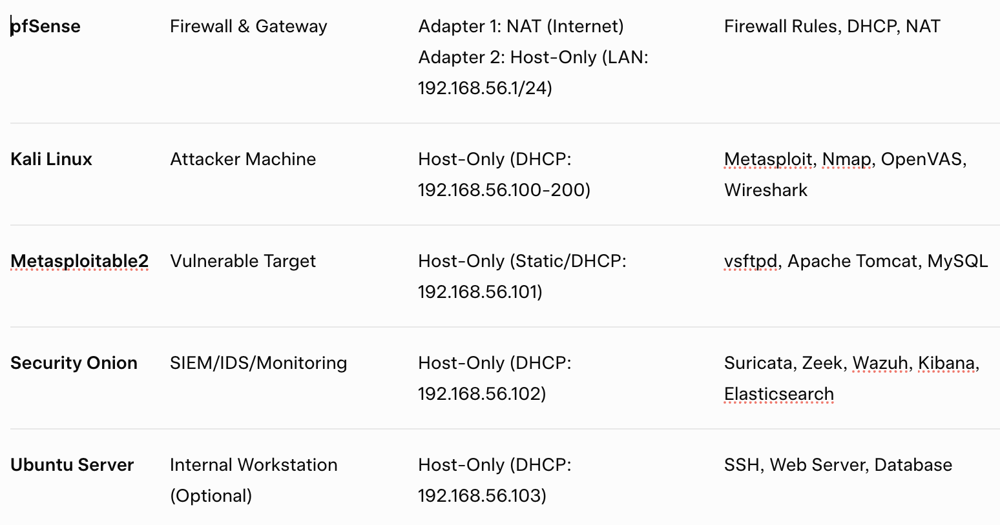
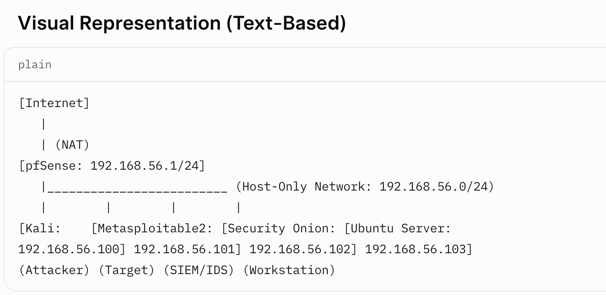

# CS-Intern
A professional-grade cybersecurity lab environment with VM setups, network configurations, and tools for hands-on training in threat detection, penetration testing, and incident response.

# Lab Environment Preparation
 Set up and validate the host system to ensure it meets the minimum technical requirements for running virtualized lab environments. The following prerequisites must be fulfilled:
 
*)VirtualBox (Primary virtualization platform)
*) VMware Workstation Player (Optional, as an alternative or secondary platform)

*)Task Start date: 05-21-2025

*)Task End Date: 06-02-2025

# 1. Executive Summary
This report outlines the design and implementation of a comprehensive cybersecurity lab environment to simulate real-world offensive and defensive security operations. Utilizing a multi-virtual machine (VM) architecture, the lab enables hands-on experience in vulnerability assessment, penetration testing, threat detection, and incident response.

The lab incorporates the following components:

*) Kali Linux as the attacker machine

*) Metasploitable2 as the vulnerable target

*) Security Onion as the monitoring and alerting system

*) pfSense as the firewall and gateway

*) Ubuntu Server as an optional internal host

 Primary Objectives:

Build a controlled cybersecurity training lab

Develop practical skills in offensive and defensive security

Conduct vulnerability assessments and penetration testing

Deploy and analyze SIEM tools for monitoring and alerting

# 2. Lab Architecture & Network Topology

#2.1 Virtualization Platform
Hypervisor: Oracle VirtualBox (cross-platform compatibility)

Networking Configuration:

Adapter 1: NAT (Internet access)

Adapter 2: Host-Only (internal isolated network)

#2.2 Virtual Machines Configuration

VM Name       Purpose        Network Configuration        Key Tools
------------------------------------------------------------------- 
     

   -----------------------------------------------------------------
#Network Diagram

   #  Step-by-Step Implementation
   # 3.1 pfSense Firewall Configuration 
     
  Installation
1. Downloaded the latest pfSense Community Edition ISO from the official website.
2. Created a new VM in VirtualBox with:
 *)GB RAM, 2 CPUs, 20 GB storage.
 *)Two network adapters:
     i)Adapter 1: NAT (for internet access).
     ii)Adapter 2: Host-Only (for internal LAN).
3. Booted the VM, followed the pfSense installer prompts, and completed the setup.   

# LAN Configuration

1. Set the LAN interface IP to 192.168.56.1/24 via the pfSense web interface (accessible at https://192.168.56.1).

2. Enabled the DHCP server to assign IPs in the range 192.168.56.100-200.

3. Configured firewall rules:

i)Allowed ICMP (ping) for network diagnostics.
ii)Permitted HTTP/HTTPS for Security Onion’s Kibana dashboard.
iii)Restricted SSH access to specific IPs (e.g., blocked Kali Linux from accessing Ubuntu Server).

#Validation
i)Verified connectivity by pinging the LAN IP from other VMs.
ii)Confirmed DHCP assignments and firewall rule enforcement via the pfSense dashboard.

# 3.2  Kali Linux (Attacker VM) Setup

# Installation

1. Downloaded the latest Kali Linux ISO (64-bit) from kali.org.
2. Created a VirtualBox VM with:
       i)4 GB RAM, 2 CPUs, 40 GB storage.
       ii)Network: Host-Only adapter (DHCP from pfSense).
3. Installed Kali Linux using the default graphical installer.

# Configuration
1. Verified the assigned IP address using ifconfig (e.g., 192.168.56.100).
2. Updated the system and tools:

sudo apt update && sudo apt full-upgrade -y

3. Installed additional tools (if not pre-installed):
sudo apt install openvas metasploit-framework wireshark -y

# Tool Validation

1. Nmap: Conducted network discovery to identify live hosts:
nmap -sP 192.168.56.0/24

2. Metasploit: Launched msfconsole and verified exploit module availability.

3. OpenVAS: Configured and ran a vulnerability scan against Metasploitable2:
openvas-setup
openvas-start
------------------------------------------------------------------------

# 3.3 Metasploitable2 (Target VM) Deployment

# Setup
1. Downloaded the Metasploitable2 VMDK from SourceForge.
2. Created a new VirtualBox VM and attached the VMDK as the primary disk.
3. Configured Host-Only networking (static IP: 192.168.56.101).
4. Logged in using default credentials:
i) Username: msfadmin
ii)Password: msfadmin

# Vulnerability Exposure
1. Confirmed running services using:

netstat -tuln

2. Identified key vulnerabilities:

i) vsftpd 2.3.4: Backdoor vulnerability.
ii) Apache Tomcat: Weak default credentials (e.g., tomcat/tomcat).
III) MySQL: Default or no password configured.

# Validation
i) Verified accessibility by pinging from Kali Linux.
ii)Confirmed vulnerable services were active using Nmap:
nmap -sV 192.168.56.101

------------------------------------------------------------------

#  3.4 Security Onion (SIEM & Monitoring) Setup
# Installation
1. Downloaded the Security Onion ISO from securityonion.net.
2. Created a VirtualBox VM with:
   i) 8 GB RAM, 4 CPUs, 100 GB storage.
   ii)Host-Only adapter (DHCP: e.g., 192.168.56.102).
3. Installed Security Onion in Evaluation Mode for simplified setup.

# Configuration
1. Configured core components:
    i) Suricata: Network IDS for real-time traffic monitoring.
    ii)Zeek: Network analysis for detailed packet inspection.
   iii)Wazuh: Host-based intrusion detection for system logs.
2. Enabled Kibana and Elasticsearch for log visualization and analysis.

# Monitoring Setup
1. Accessed the Kibana dashboard at https://192.168.56.102.
2. Configured dashboards to monitor:

  i)Network traffic (Suricata alerts).
  ii)Suspicious activities (e.g., port scans, brute-force attempts).

3. Set up automated alerts for critical events using TheHive integration.

# Validation

i) Generated test traffic (e.g., Nmap scans) and verified alerts in Kibana.
ii) Exported incident reports for analysis.
-----------------------------------------------------------------------

# 4. Attack Simulation & Defensive Measures

4.1 Penetration Testing (Offensive Security)

# Reconnaissance
1. Performed network discovery using Nmap:

nmap -A -T4 192.168.56.0/24
 
 i) Identified live hosts (e.g., Metasploitable2 at 192.168.56.101).
 ii) Enumerated open ports and services (e.g., FTP, SSH, HTTP).
 
 # Exploitation
1. Launched Metasploit to exploit the vsftpd 2.3.4 backdoor:

msfconsole
use exploit/unix/ftp/vsftpd_234_backdoor
set RHOST 192.168.56.101
run

2. Established a reverse shell and escalated privileges using known exploits.

# Post-Exploitation

1. Captured system information (e.g., /etc/passwd).
2. Attempted lateral movement to other VMs (blocked by pfSense rules).

---------------------------------------------------------------

# 4.2 Defensive Monitoring (Blue Team)

# SIEM Analysis

1. Reviewed Suricata alerts in Security Onion for exploit attempts.
2. Correlated logs in Kibana to identify attack patterns (e.g., repeated FTP connections).
3. Generated visualizations for attack timelines and IOCs.

# Incident Response
1. Documented IOCs:
   i) Malicious IP: 192.168.56.100 (Kali Linux).
   ii)Exploit: vsftpd 2.3.4 backdoor.
2. Implemented firewall rules in pfSense to block malicious traffic:
   *) Rule: Deny TCP/UDP from 192.168.56.100 to 192.168.56.101.
3. Patched Metasploitable2 vulnerabilities (e.g., disabled vsftpd service).

------------------------------------------------------------------

# 5.Conclusion & Lessons Learned

This project successfully simulated a real-world cybersecurity environment, enabling practical experience in offensive and defensive operations. Key outcomes include:

1. Proficiency in configuring and securing a multi-VM lab environment.
2. Hands-on skills in penetration testing using tools like Nmap, Metasploit, and OpenVAS.
3. Expertise in monitoring and responding to threats using Security Onion’s SIEM capabilities.
4. Improved understanding of firewall configuration and network security policies.

# Recommendations for Future Enhancements

*)Incorporate a Windows Server VM to simulate enterprise-specific vulnerabilities.

*)Implement automated response playbooks in Security Onion for faster incident mitigation.

*)Conduct red team vs. blue team exercises to enhance adversarial simulation
-----------------------------------------------------------------------------

Prepared by:
Mohammad Shahriar
571-337-1766
shahriarin2012@gmail.com
